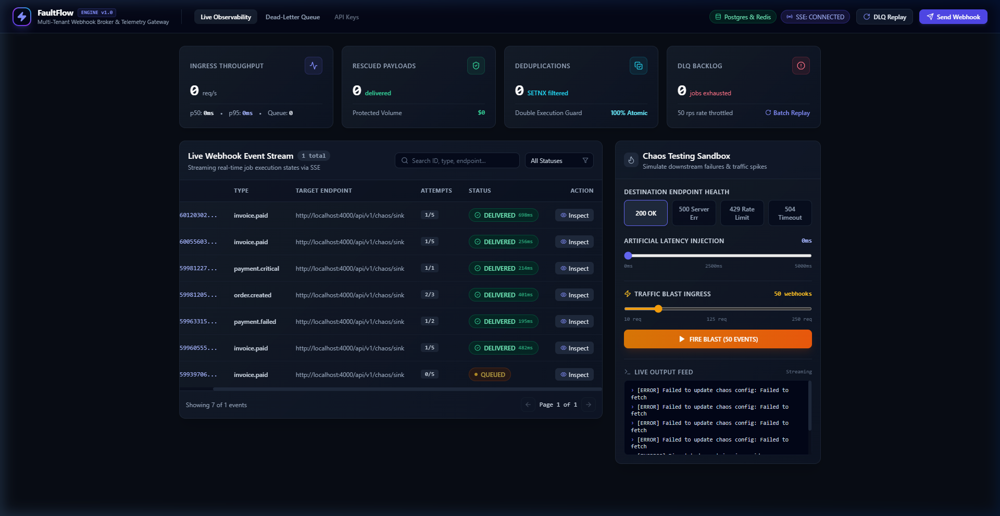
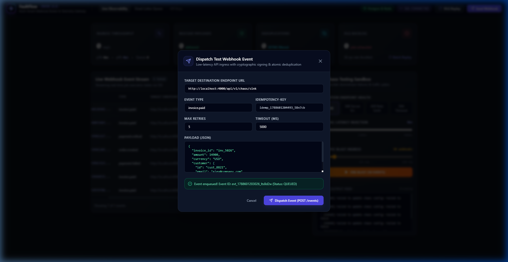
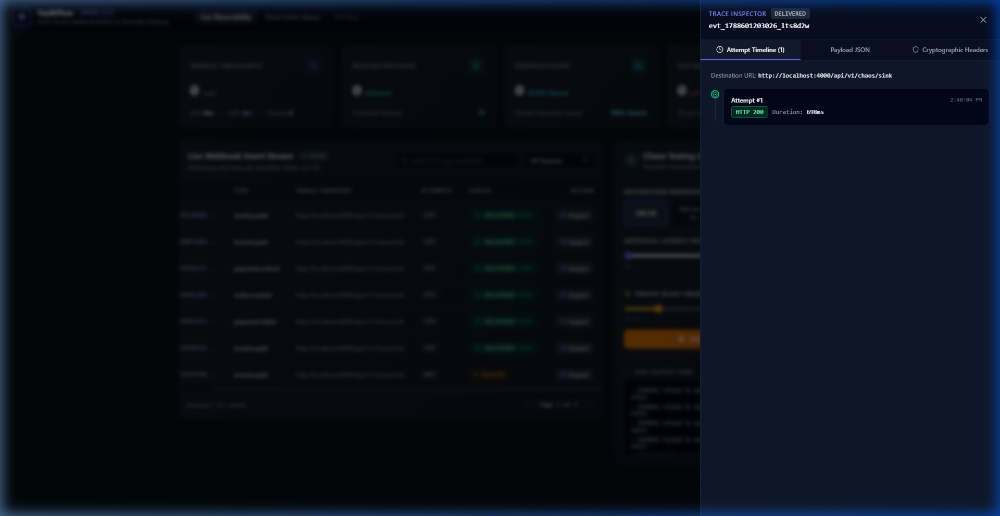
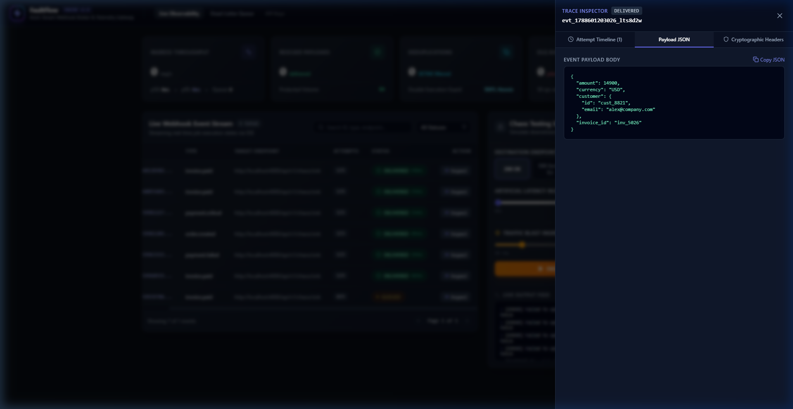
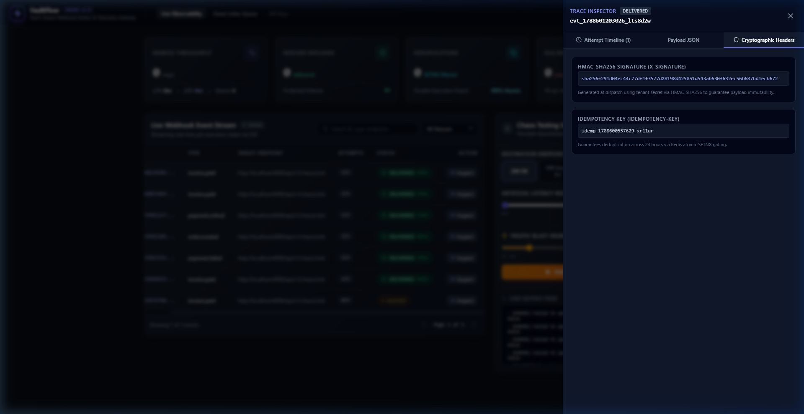
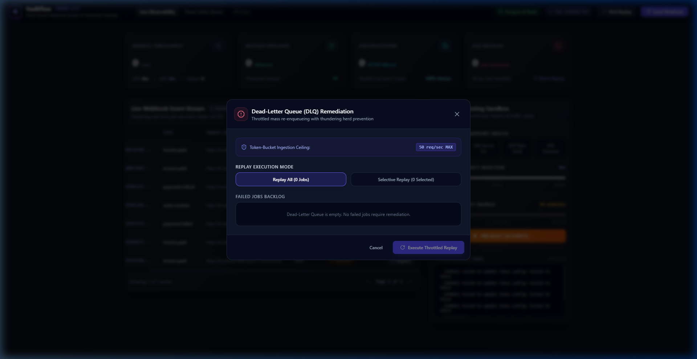

# FaultFlow — Complete UI Walkthrough
> **Audience:** Product demo, stakeholder review, onboarding guide
> **Perspective:** UX / Product Manager — *what you see on screen*, not code
> **Version:** ENGINE v1.0

---

## Table of Contents
1. [Visual Screen Breakdown (A to Z)](#1-visual-screen-breakdown-a-to-z)
2. [Button-by-Button Interactions](#2-button-by-button-interactions)
3. [The User Journey (Step-by-Step)](#3-the-user-journey-step-by-step)
4. [Top 10 Product & Interface Q&A](#4-top-10-product--interface-qa)

---

## 1. Visual Screen Breakdown (A to Z)

### A — The Header & Navigation Bar (Top Strip)

The very top strip of the screen is a dark, frosted-glass bar that stays **fixed** as you scroll. It holds everything you need to orient yourself and take quick action.

**Left side** — The brand identity:
- A lightning-bolt logo in an indigo/cyan gradient square
- The product name **FaultFlow** in bold white
- A small pill badge reading **ENGINE v1.0**
- A subtitle: *Multi-Tenant Webhook Broker & Telemetry Gateway*

**Centre navigation links** (three items):
- **Live Observability** — highlighted as the current, active page
- **Dead-Letter Queue** — a clickable link that opens the DLQ Replay panel
- **API Keys** — visible but greyed out (coming soon, not yet active)

**Right side** — three status/action elements:
- A green pill: **Postgres & Redis** — shows that both database services are online
- A pulsing indigo pill: **SSE: CONNECTED** — real-time data feed is live (turns red if disconnected)
- A grey button: **DLQ Replay** — shortcut to open the Dead-Letter Queue manager
- A glowing indigo button: **Send Webhook** — the primary call-to-action to test a webhook dispatch

---

### B — The Top Metric Bar (4 KPI Cards)

Directly below the header are four dark cards arranged in a horizontal row. These are the **live health gauges** of the system. They update automatically in real-time as events flow through.

| Card | What it shows |
|------|---------------|
| **INGRESS THROUGHPUT** | How many webhook events per second are flowing in. Shows p50, p95 latency, and queue depth |
| **RESCUED PAYLOADS** | Count of events that initially failed but were automatically re-delivered. Shows total "Protected Volume" in dollars |
| **DEDUPLICATIONS** | Count of duplicate events the system silently blocked. Labelled *SETNX filtered* — means it caught them atomically |
| **DLQ BACKLOG** | Events that have permanently failed and are sitting in the Dead-Letter Queue. Shows a "jobs exhausted" counter and a **Batch Replay** shortcut |

> **Plain-English summary:** Think of these four cards as the vital signs monitor of a hospital dashboard — they tell you at a glance if the system is healthy, overwhelmed, or has stuck jobs that need attention.

---

### C — The Live Webhook Event Stream Table (Main Content — Left)

Taking up roughly two-thirds of the main workspace, this is the **real-time event log**. Every webhook event that enters the system appears here as a row, updating live without you needing to refresh the page.

**Above the table:**
- Title: **Live Webhook Event Stream** + a count badge (e.g., *1 total*)
- Subtitle: *Streaming real-time job execution states via SSE*
- **Search bar** — type an event ID, type, or endpoint URL to filter rows instantly
- **All Statuses dropdown** — filter the table to show only events with a specific status

**Table columns:**

| Column | What it shows |
|--------|---------------|
| *(row ID — truncated)* | A short version of the unique event ID (e.g., `60120302...`) |
| **TYPE** | The event category (e.g., `invoice.paid`, `order.created`, `payment.failed`) |
| **TARGET ENDPOINT** | The URL the webhook was delivered to |
| **ATTEMPTS** | How many delivery attempts were made vs. the max allowed (e.g., `1/5`, `2/3`) |
| **STATUS** | A coloured badge showing the current state |
| **ACTION** | An **Inspect** button on every row |

**Status Badges (colour legend):**

| Badge | Colour | Meaning |
|-------|--------|---------|
| `QUEUED` | Pulsing amber/yellow | The event is waiting to be sent for the first time |
| `PROCESSING` | Blue with spinning icon | Actively being sent right now |
| `RETRYING` | Indigo with spinning icon + countdown | Failed once, now waiting to retry. Shows e.g. `(2/5) in 4s` |
| `DELIVERED` | Green with a checkmark + ms number | Successfully delivered. The ms number shows how fast |
| `DEAD-LETTERED` | Red with X icon + Replay button | Failed all retry attempts. Needs manual recovery |
| `CIRCUIT HOLD` | Purple with pause icon | System paused delivery to protect a struggling endpoint |

**Below the table:**
- Pagination controls: *Showing 7 of X events* with `<- Page 1 of N ->` arrows

---

### D — The Chaos Testing Sandbox (Right Panel)

The right column is a dark control panel labelled **Chaos Testing Sandbox** with the subtitle *Simulate downstream failures & traffic spikes*. This is where you deliberately break things to test how the system recovers.

It contains **four sub-sections**:

**Destination Endpoint Health — 4 toggle buttons:**
- `200 OK` (currently selected, highlighted blue)
- `500 Server Err`
- `429 Rate Limit`
- `504 Timeout`

These buttons change what HTTP response the system's dummy endpoint sends back.

**Artificial Latency Injection — slider:**
- A horizontal slider from `0ms` to `5000ms`
- Currently set to `0ms` (far left)
- Adds artificial delay to every response so you can see how the system handles slow endpoints

**Traffic Blast Ingress — slider + button:**
- A horizontal slider from `10 req` to `250 req`
- Currently set to `50 webhooks`
- A large orange button: **FIRE BLAST (50 EVENTS)**
- Clicking the button floods the system with however many events the slider is set to

**Live Output Feed — scrolling log terminal:**
- A dark terminal-style box labelled **LIVE OUTPUT FEED · Streaming**
- Shows real-time log lines, colour-coded:
  - `[ERROR]` in red — failures and chaos config errors
  - `[SUCCESS]` in green — confirmations
  - Other lines in white/grey — status updates

---

### E — The Dispatch Test Webhook Modal (Pop-up Form)

This modal (pop-up overlay) appears when you click the **Send Webhook** button in the top-right corner. The background dims and a centred card appears.

**Form fields:**

| Field | What you enter |
|-------|---------------|
| **Target Destination Endpoint URL** | The full URL to send the webhook to (pre-filled with the chaos sink URL) |
| **Event Type** | The event name, e.g., `invoice.paid` |
| **Idempotency-Key** | Auto-generated unique key to prevent duplicate processing |
| **Max Retries** | How many times to retry on failure (default: 5) |
| **Timeout (ms)** | How long to wait for a response before treating it as a failure (default: 5000) |
| **Payload (JSON)** | The actual data body of the webhook — a code editor showing formatted JSON |

**Below the form:**
- A green success notice appears after sending: *Event enqueued! Event ID: evt_xxx (Status: QUEUED)*

**Action buttons:**
- `Cancel` — closes the modal without doing anything
- `Dispatch Event (POST /events)` — indigo button, sends the webhook and shows the success notice

---

### F — The Event Trace Drawer (Right-Side Inspector Panel)

**Attempt Timeline tab (default view):**

Clicking the **Inspect** button on any table row slides open a full-height panel from the right side of the screen. The main content dims into the background.

**At the top of the drawer:**
- Label: **TRACE INSPECTOR**
- Status badge (e.g., `DELIVERED` in green)
- The full event ID (e.g., `evt_1788601203026_lts8d2w`)
- A close X button

**Three tabs inside the drawer:**

The **Attempt Timeline** tab (default view) shows:
- The destination URL at the top
- Every delivery attempt as a card: attempt number, timestamp, HTTP status code badge (`HTTP 200` in green), and duration in milliseconds

**Payload JSON tab:**

- Shows the raw data that was sent in the webhook
- Syntax-highlighted JSON in a dark code box
- A **Copy JSON** button in the top-right corner to copy the payload to clipboard

**Cryptographic Headers tab:**

- **HMAC-SHA256 Signature** — the security signature attached to the webhook (proves the payload was not tampered with)
- **Idempotency Key** — the unique identifier that prevents the same event from being processed twice

---

### G — The DLQ Remediation Modal (Dead-Letter Queue Manager)

This modal opens when you click **DLQ Replay** (top-right header button) or **Dead-Letter Queue** (nav link). It is specifically for recovering webhook events that failed all their retries.

**Top info bar:**
- Title: **Dead-Letter Queue (DLQ) Remediation**
- Subtitle: *Throttled mass re-enqueueing with thundering herd prevention*
- Rate ceiling indicator: **Token-Bucket Ingestion Ceiling: 50 req/sec MAX**

**Replay Execution Mode — two toggle buttons:**
- `Replay All (0 Jobs)` — re-queue every failed event in one action
- `Selective Replay (0 Selected)` — pick and choose which specific events to retry

**Failed Jobs Backlog list:**
- Shows each failed event as a selectable row
- Message when empty: *Dead-Letter Queue is empty. No failed jobs require remediation.*

**Action buttons:**
- `Cancel` — closes the modal
- `Execute Throttled Replay` — processes recovery at a safe, controlled rate

---

## 2. Button-by-Button Interactions

### Header Bar

**[Send Webhook]:** Indigo filled button, top-right corner. Opens the **Dispatch Test Webhook Modal** — a centred pop-up overlay dims the background and shows the webhook form.

**[DLQ Replay]:** Grey outlined button with a circular-arrow icon. Opens the **DLQ Remediation Modal** — a pop-up showing the failed jobs backlog and replay options.

**[Dead-Letter Queue]** *(nav link)*: Clicking opens the same **DLQ Remediation Modal** as the header button.

**[Live Observability]** *(nav item)*: Already highlighted/selected. Clicking has no effect — you are already on this page.

**[API Keys]** *(nav item)*: Greyed out — this feature is not yet active. Clicking has no visible effect.

**[Postgres & Redis]** *(status pill)*: Passive indicator only. Not clickable. Shows both database services are healthy.

**[SSE: CONNECTED / SSE: RECONNECTING]** *(status pill)*: Passive indicator only. Not clickable. Indigo/pulsing = live stream active. Red = connection lost, attempting to reconnect.

---

### Top Metric Bar (KPI Cards)

**[Batch Replay]** *(link inside DLQ Backlog card)*: Small text link inside the fourth metric card. Opens the DLQ Remediation Modal.

All four KPI cards: **Not clickable.** They display live-updating numbers only.

---

### Event Stream Table

**[Search bar]:** Text input with a magnifying glass icon. As you type, the table rows filter in real-time to show only events matching your text (event ID, type, or endpoint URL).

**[All Statuses dropdown]:** Clicking reveals status options: *All Statuses, QUEUED, PROCESSING, RETRYING, DELIVERED, DEAD-LETTERED, CIRCUIT HOLD*. Selecting one narrows the table to that status only.

**[Inspect]** *(per row)*: Ghost/outline button on the right of every event row. Clicking slides open the **Event Trace Drawer** from the right — background dims and a full inspection panel appears for that specific event.

**[Replay]** *(inside DEAD-LETTERED badge)*: A small dark-red button embedded inside the red badge, visible only on `DEAD-LETTERED` rows. Clicking immediately re-queues that single event for delivery.

**[<- Previous / Next ->]** *(pagination)*: Arrow buttons below the table. Navigate to the previous or next page of events. The page indicator (e.g., *Page 1 of 3*) updates accordingly.

---

### Chaos Testing Sandbox

**[200 OK]** *(endpoint health toggle)*: Blue highlighted (selected by default). Sets the dummy endpoint to return success — events should show as `DELIVERED`.

**[500 Server Err]** *(endpoint health toggle)*: Sets the endpoint to return HTTP 500 errors — events in the stream start failing, retrying, and eventually moving to `DEAD-LETTERED`.

**[429 Rate Limit]** *(endpoint health toggle)*: Makes the endpoint respond with HTTP 429 Too Many Requests — events slow down with exponential backoff retries.

**[504 Timeout]** *(endpoint health toggle)*: Makes the endpoint never respond — events hit their timeout window and retry, triggering circuit-breaker behaviour.

**[Artificial Latency slider]:** Drag from 0ms to 5000ms. The label on the right updates live as you drag. The Live Output Feed logs the config change. Adds real delay to every endpoint response.

**[Traffic Blast Ingress slider]:** Drag from 10 req to 250 req. The orange FIRE BLAST button label updates live to reflect the current number.

**[FIRE BLAST (N EVENTS)]:** Large orange button. Clicking fires a burst of N test webhook events into the system simultaneously. The event table fills with new rows transitioning through `QUEUED` -> `PROCESSING` -> `DELIVERED` (or failing states if chaos is enabled). The Live Output Feed logs each event dispatch.

---

### Event Trace Drawer (Inspect Panel)

**[X Close button]** *(top-right of drawer)*: Slides the drawer closed, returning the dashboard to full-view.

**[Attempt Timeline tab]:** Shows the chronological list of every delivery attempt with HTTP status codes and durations.

**[Payload JSON tab]:** Switches the view to display the full raw JSON payload that was sent in the webhook.

**[Cryptographic Headers tab]:** Shows the HMAC security signature and idempotency key for the event.

**[Copy JSON]** *(inside Payload JSON tab)*: Copies the entire payload JSON to your clipboard.

---

### Dispatch Test Webhook Modal

**[Target Destination Endpoint URL field]:** Text input. Edit to change where the webhook is sent.

**[Event Type field]:** Text input. Type the event category (e.g., `payment.failed`, `user.signup`).

**[Idempotency-Key field]:** Text input, auto-generated. You can leave it as-is or type your own unique key.

**[Max Retries field]:** Number input. Controls how many times the system retries on failure.

**[Timeout (ms) field]:** Number input. Controls how long to wait for a response before treating it as a failure.

**[Payload (JSON) editor]:** Scrollable code editor. Edit the JSON object to customise the webhook body.

**[Dispatch Event (POST /events)]:** Indigo button at the bottom. Submits the form, sends the webhook, and immediately shows a green success notice: *Event enqueued! Event ID: evt_xxx (Status: QUEUED)*. The event also appears instantly in the main event stream table.

**[Cancel]:** Grey text button. Closes the modal without sending anything.

---

### DLQ Remediation Modal

**[Replay All (N Jobs)]:** Toggle button — when selected, clicking Execute Throttled Replay will re-queue every failed job in the backlog.

**[Selective Replay (N Selected)]:** Toggle button — when selected, individual job rows in the backlog become selectable. Only checked/selected jobs will be replayed.

**[Execute Throttled Replay]:** Purple/indigo button at the bottom. Starts the recovery process for all selected failed jobs at a controlled rate of up to 50 req/sec. The table updates as events re-enter the processing pipeline.

**[Cancel]:** Grey text button. Closes the modal without replaying anything.

---

## 3. The User Journey (Step-by-Step)

### Act 1: Arrive and Orient

**Step 1:** The user opens the browser to `http://localhost:3000`. The dark-themed dashboard loads instantly. The header shows **SSE: CONNECTED** pulsing in indigo — live data is already flowing.

**Step 2:** The user reads the 4 KPI cards at the top. If the system has been running, they see counters for throughput, rescued payloads, deduplications, and any backlog. If this is a fresh start, all counters show **0**.

**Step 3:** The user looks at the main event table. Existing events are listed as rows. Status badges show a mix of green `DELIVERED`, amber `QUEUED`, and possibly red `DEAD-LETTERED`. New events arriving via the live stream appear at the top of the table without any page refresh.

---

### Act 2: Send a Test Webhook

**Step 4:** The user wants to test the system. They click the glowing **Send Webhook** button (top-right, indigo). The modal slides in.

**Step 5:** The user reviews the pre-filled form: the endpoint URL points to the chaos sink, the event type is `invoice.paid`, the payload shows sample invoice data. They optionally change the event type or payload.

**Step 6:** The user clicks **Dispatch Event**. Instantly, a green success bar appears at the bottom of the modal: *"Event enqueued! Event ID: evt_xxx"*. The user closes the modal.

**Step 7:** The user watches the main table. Within seconds, a new row appears at the top with the `QUEUED` amber badge, which then flips to `PROCESSING` (blue spinner), and finally to `DELIVERED` (green checkmark with a millisecond reading).

---

### Act 3: Inspect an Event

**Step 8:** The user is curious about a specific event. They click the **Inspect** button on any row.

**Step 9:** A panel slides in from the right. The user sees:
- **Attempt Timeline tab** (default): Attempt #1, HTTP 200, completed in 698ms.
- They click **Payload JSON** to see the full data body that was transmitted.
- They click **Cryptographic Headers** to see the security signature and deduplication key.

**Step 10:** The user clicks the **X** button. The drawer closes and the full dashboard returns.

---

### Act 4: Simulate a Failure with Chaos Testing

**Step 11:** The user wants to see what happens when the destination is broken. They find the **Chaos Testing Sandbox** panel on the right side of the dashboard.

**Step 12:** They click the **500 Server Err** button in the "Destination Endpoint Health" section. The button highlights to show it is now active.

**Step 13:** The user drags the **Traffic Blast** slider from `10 req` to `125 req`. The orange button now reads *FIRE BLAST (125 EVENTS)*.

**Step 14:** They click **FIRE BLAST**. The event table fills with 125 new rows, all starting as `QUEUED`. Within seconds, they start failing — badges cycle from `PROCESSING` to `RETRYING (1/5) in 4s` to `RETRYING (2/5) in 8s`, with spinning indigo indicators. The Live Output Feed scrolls with real-time error logs.

**Step 15:** The user clicks **200 OK** to restore the endpoint to healthy. They watch as the retrying events eventually flip back to `DELIVERED` on a later retry attempt.

---

### Act 5: Recover Dead-Letter Events

**Step 16:** After a chaos test where the endpoint stayed broken long enough, some events have given up and show the `DEAD-LETTERED` badge (red with X icon).

**Step 17:** The user clicks **DLQ Replay** in the header (or the **Batch Replay** link in the DLQ Backlog card, or the **Dead-Letter Queue** nav link).

**Step 18:** The DLQ Remediation Modal opens. The **Failed Jobs Backlog** section lists all the dead-lettered events. The user sees the rate ceiling: *50 req/sec MAX*.

**Step 19:** The user can either:
- Click **Replay All** then **Execute Throttled Replay** to recover everything at once, OR
- Switch to **Selective Replay**, check individual rows, then execute to recover just those specific events.

**Step 20:** The system re-queues the selected events. The user closes the modal and watches the table — the red `DEAD-LETTERED` rows disappear and new `QUEUED` rows appear as the events re-enter the pipeline.

---

### Act 6: Filter and Search

**Step 21:** With a large event history, the user wants to find a specific event. They type `payment.failed` in the **Search bar** above the table. Only rows matching that event type remain visible.

**Step 22:** Alternatively, they use the **All Statuses** dropdown and select `RETRYING` to see only events currently in the retry loop.

**Step 23:** If there are multiple pages of results, the user uses the **<- / ->** pagination buttons below the table to navigate through them.

---

## 4. Top 10 Product & Interface Q&A

---

**Q1: What does the pulsing amber "QUEUED" badge mean, and should I be worried?**

**A:** No — it just means the event has been accepted by the system and is waiting its turn to be sent for the first time. The pulsing animation shows it is alive and active. This is normal. Within a second or two it will turn blue (PROCESSING) and then green (DELIVERED). Only worry if it stays QUEUED for a very long time without changing.

---

**Q2: What does the green "DELIVERED 698ms" badge mean? What is the millisecond number?**

**A:** DELIVERED means the destination server received the webhook and sent back a success response. The number (e.g., 698ms) is the round-trip delivery time — how long the entire send-and-confirm took. Lower is faster. Anything under 1,000ms is generally healthy.

---

**Q3: A row is showing "RETRYING (2/5) in 4s" with a spinning icon. What is happening?**

**A:** The first delivery attempt failed (e.g., the destination returned an error). The system is automatically trying again. The `2/5` means this is the 2nd attempt out of a maximum of 5. The `in 4s` countdown shows when the next attempt will fire. You do not need to do anything — the system handles this automatically.

---

**Q4: What happens after all 5 retries fail? What does "DEAD-LETTERED" mean?**

**A:** When all retry attempts are exhausted, the event gets moved to the Dead-Letter Queue (DLQ) and the badge turns red with an X icon. It will no longer be retried automatically. You need to manually decide to replay it using the DLQ Replay feature or the Replay button on the row itself.

---

**Q5: How do I replay a single failed event without opening the batch replay modal?**

**A:** Find the `DEAD-LETTERED` row in the table. Its red status badge contains a small **Replay** button embedded inside it. Clicking that button immediately re-queues just that one event — no modal required. You will see it disappear from the dead-letter state and a new QUEUED row appear moments later.

---

**Q6: What is the Chaos Testing Sandbox for? Is it safe to use?**

**A:** Yes — it is completely safe and designed for experimentation. The sandbox lets you deliberately break the system's destination endpoint to watch FaultFlow's retry, timeout, and circuit-breaker logic in action. You can simulate server errors (500), rate-limiting (429), and timeouts (504), and then restore normal behaviour by clicking 200 OK. It helps you demo the resilience features without needing a real broken API.

---

**Q7: What does "SSE: CONNECTED" mean in the top-right corner?**

**A:** SSE stands for Server-Sent Events — it is the live data pipeline that pushes real-time updates directly to your browser. When the pill shows SSE: CONNECTED in indigo/blue with a pulsing animation, the dashboard is receiving live event updates automatically. If it turns red and says SSE: RECONNECTING, the live stream was interrupted and is trying to reconnect — the table will still show data but may not update until reconnected.

---

**Q8: What are the "Postgres & Redis" and "Deduplications / SETNX filtered" labels in plain English?**

**A:** These are trust signals:
- **Postgres & Redis** (green pill in the header): Both databases are healthy and online. The system is fully operational.
- **SETNX filtered** (in the Deduplications card): The system automatically detected and silently dropped duplicate webhook events, so your destination never received the same event twice. This is important for billing or order systems where processing the same event twice could cause serious problems.

---

**Q9: What is the "Idempotency-Key" in the Dispatch modal and the Inspect drawer?**

**A:** An idempotency key is a unique identifier attached to every webhook. If the same webhook is accidentally sent twice (a common problem in distributed systems), the idempotency key lets the system recognise it as a duplicate and block the second one from being delivered. In plain English: it is a guard tag that says "I have seen this one before, do not process it again." You can see this key in the Cryptographic Headers tab of the Event Trace Drawer.

---

**Q10: I see a "Token-Bucket Ingestion Ceiling: 50 req/sec MAX" in the DLQ modal. What does that protect against?**

**A:** Imagine you have 1,000 failed events in the DLQ. If you replay all 1,000 at once, the sudden flood could overwhelm the destination server all over again — causing the same failures that put events in the DLQ in the first place. This is called a "thundering herd" problem. The 50 req/sec ceiling is a safety valve: even if you hit "Replay All (1,000 jobs)", the system will only send 50 per second, smoothly and safely, until all events are re-delivered.

---

*Generated by Antigravity — FaultFlow ENGINE v1.0 | UI Walkthrough Document*
